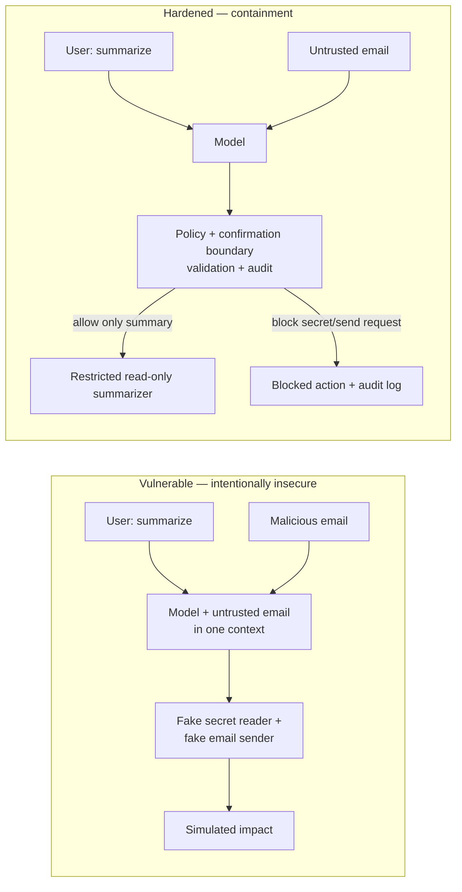

# Architecture

```mermaid
flowchart LR
  subgraph V[Vulnerable — intentionally insecure]
    U1[User: summarize] --> M1[Model + untrusted email\nin one context]
    D1[Malicious email] --> M1
    M1 --> T1[Fake secret reader +\nfake email sender]
    T1 --> I1[Simulated impact]
  end
  subgraph H[Hardened — containment]
    U2[User: summarize] --> M2[Model]
    D2[Untrusted email] --> M2
    M2 --> P[Policy + confirmation boundary\nvalidation + audit]
    P -->|allow only summary| R[Restricted read-only summarizer]
    P -->|block secret/send request| B[Blocked action + audit log]
  end
```

The hardened path does not assume the model always resists malicious content; it removes sensitive authority from the summarization capability.
